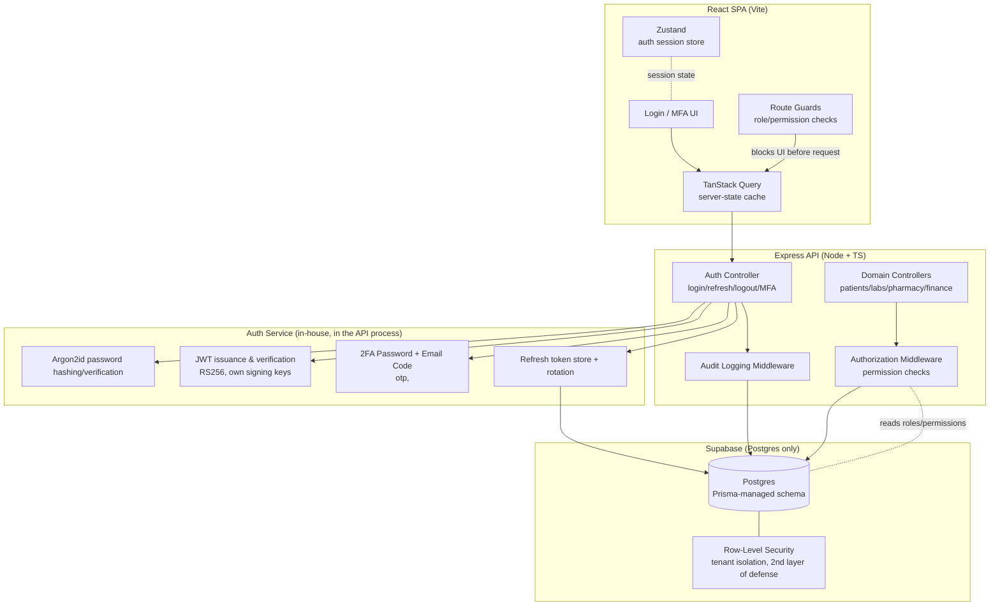
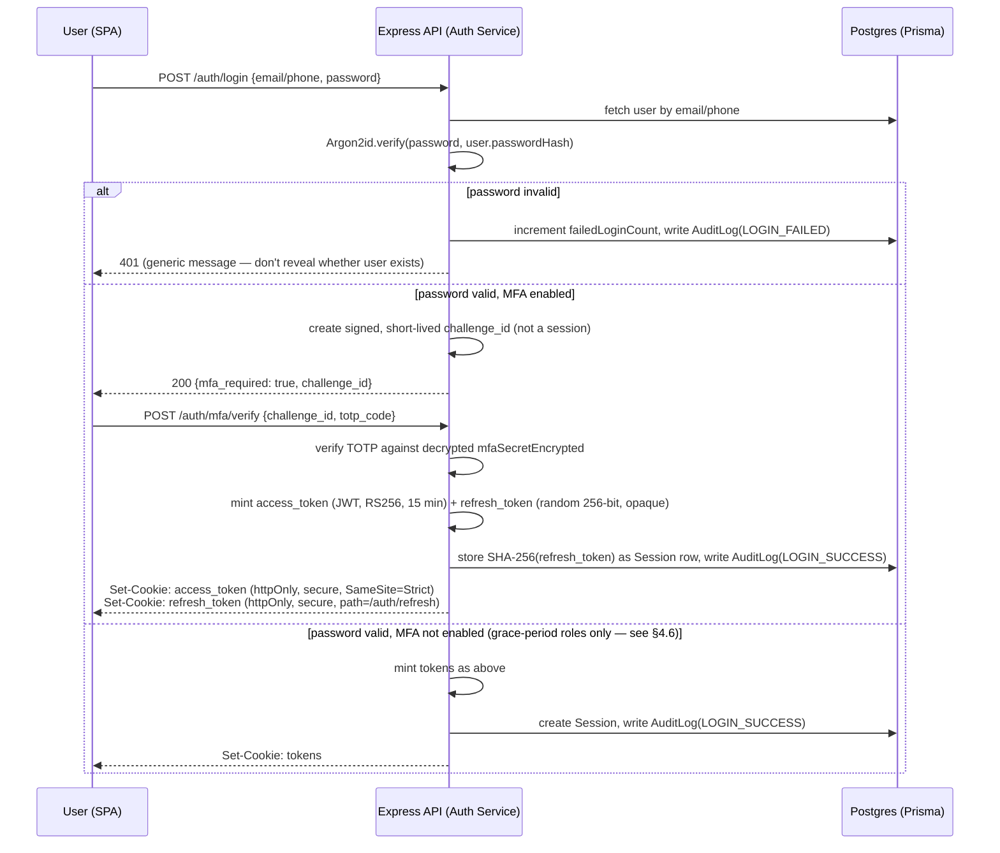

# Hospital Management System — Authentication & Authorization Architecture

**Stack**: Node.js + TypeScript + Express + Prisma + PostgreSQL (Supabase, used as managed DB only) · Zod
**Auth**: fully in-house — Argon2id password hashing, own JWT issuance/verification, 2FA Password + Email Code, own refresh-token rotation. No Supabase Auth.
**Frontend**: React + Vite + Tailwind + React Hook Form + Zod resolvers + TanStack Query + Zustand
**Region default**: Kenya (Data Protection Act 2019 / ODPC, Digital Health Act 2023) — flag if you also serve other jurisdictions

---

## 1. Requirements Recap

**Context**: Auth subsystem for a Hospital Management System (HMS). Multiple facilities are implied by the `SuperAdmin` / `Hospital Admin` split, so this design assumes a **multi-tenant** system (one platform, many facility tenants) — flag if you actually mean a single facility, since that removes a whole layer of scoping. A facility can itself have branches or satellite clinics under it (§3.1) — this adds a hierarchy dimension on top of multi-tenancy, not a replacement for it.

**Roles (15)**: SuperAdmin, Hospital Admin, Doctor, Nurse, Receptionist, Lab Tech, Pharm Tech, Auditor, Accountant, Finance Manager, Lab Manager, Pharmacy Manager, Records Officer, Records Manager, Patient.

**Functional requirements**:
- Staff login (email/password + MFA) and patient login (likely phone/OTP-first, given mobile-first usage in Kenya)
- Fine-grained authorization — 15 roles with clearly overlapping-but-distinct permissions (e.g. Lab Manager vs Lab Tech, Accountant vs Finance Manager) means **role-only** checks won't scale; this needs permission-based RBAC, not a hardcoded role enum
- MFA (mandatory for clinical/financial/admin roles at minimum)
- Full audit logging of auth events and sensitive data access
- Multi-tenant isolation (a Hospital Admin at Facility A must never see Facility B's data)

**Non-functional requirements**:
- Availability target: 99.9% (clinical system — login outage blocks care delivery)
- Compliance: Kenya DPA 2019 / ODPC registration as a data controller/processor; Digital Health Act 2023 for health-data-specific obligations; SHA interoperability is a *future* integration point, not in this pass
- Connectivity: assume some users on low-bandwidth mobile connections — auth payloads and MFA flows should stay lightweight (SMS OTP fallback for patients, not app-only MFA)

**Explicit non-goals for this pass**:
- SHA (Social Health Authority) integration
- Patient-facing mobile app (assume patient portal is web via the same Vite SPA for now)
- Billing/M-Pesa integration (flagged as a likely future integration, not designed here)

---

## 2. High-Level Architecture



**Data flow, in words**: the SPA never talks to Supabase directly — it goes through the Express API, which is the single point where credentials are verified, tokens are issued, authorization decisions are made, and audit logging happens. Supabase is used purely as managed Postgres here; there is no external auth provider. Password hashing (Argon2id), JWT signing/verification, 2FA Password + Email Code, and refresh-token rotation all live in the API codebase, using well-audited libraries rather than hand-rolled crypto (see ADR-01 for why this is a deliberate, higher-responsibility trade-off). **Authorization** (who can do what) is modeled in your own `roles`/`permissions` tables and enforced in Express middleware. Row-Level Security in Postgres is a *second* independent layer, not the primary one — defense in depth in case the API layer has a bug.

---

## 3. Data Model

### 3.1 Core auth/RBAC schema (Prisma)

With 15 roles that have overlapping permissions (a Records Manager likely has everything a Records Officer has, plus more), hardcoding `role: enum` on the user and switching on it in code will rot fast. Model roles and permissions as data.

A facility can be a standalone hospital, or one with branches/satellite clinics under it — modeled as a self-referencing `Facility` hierarchy (`parentFacilityId`) rather than a separate table, since a branch and a satellite clinic are structurally the same thing (a facility scoped under a parent) with different operational weight. `User.facilityId` and `UserRole.facilityId` always point at the **specific** facility a person is tied to — a receptionist at a satellite clinic has `facilityId` = that clinic's id, not the parent hospital's.

**Open design question, needs a decision before building**: does a `Hospital Admin`'s access **cascade** to their hospital's branches/satellite clinics, or is each facility (including branches) administered independently, with a separate `HospitalAdmin` `UserRole` grant per facility? Cascading is more convenient for a real admin managing a small network, but it means the authorization middleware (§4.3) and RLS policies (§4.5) both need to walk the `parentFacilityId` chain instead of doing a flat equality check — more moving parts, and a bug in that walk is a cross-facility leak in exactly the place you're trying hardest to avoid one. Recommend starting **without cascading** (flat per-facility grants, `SuperAdmin` is the only role with cross-facility reach) and revisiting once real usage shows admins constantly re-granting themselves access branch-by-branch.

```prisma
enum FacilityType {
  HOSPITAL          // top-level facility — owns its branches/clinics
  BRANCH            // a branch of a parent hospital, same organization
  SATELLITE_CLINIC  // a smaller, often single-service clinic under a parent hospital
}

model Facility {
  id               String       @id @default(uuid())
  name             String
  type             FacilityType @default(HOSPITAL)
  parentFacilityId String?      // null for a top-level HOSPITAL; set for BRANCH/SATELLITE_CLINIC
  parentFacility   Facility?    @relation("FacilityHierarchy", fields: [parentFacilityId], references: [id])
  branches         Facility[]   @relation("FacilityHierarchy")
  isActive         Boolean      @default(true)
  createdAt        DateTime     @default(now())

  users       User[]
  departments Department[]
  auditLogs   AuditLog[]

  @@index([parentFacilityId])
}

model Department {
  id         String   @id @default(uuid())
  facilityId String
  facility   Facility @relation(fields: [facilityId], references: [id])
  name       String   // e.g. "Radiology", "Pediatrics", "Laboratory", "Pharmacy", "Finance", "Records"
  isActive   Boolean  @default(true)
  createdAt  DateTime @default(now())

  users User[]
  roles UserRole[]

  @@unique([facilityId, name])
  @@index([facilityId])
}

model User {
  id                String    @id @default(uuid())
  facilityId        String?   // null only for SuperAdmin (platform-level)
  facility          Facility? @relation(fields: [facilityId], references: [id])
  departmentId      String?   // home/primary department — nullable (SuperAdmin, HospitalAdmin, Patient have none)
  department        Department? @relation(fields: [departmentId], references: [id])
  email             String?   @unique
  phone             String?   @unique   // primary identifier for Patient role
  fullName          String
  passwordHash      String    // Argon2id hash — never store or log the plaintext, ever
  isActive          Boolean   @default(true)
  mfaEnabled        Boolean   @default(false)
  mfaSecretEncrypted String?  // TOTP secret, encrypted at rest (envelope-encrypted, KMS-backed key)
  mfaEnforcedAt     DateTime? // set when org policy required MFA; null = grace period
  failedLoginCount  Int       @default(0) // for lockout/backoff — see §4.6a
  lockedUntil       DateTime?
  lastLoginAt       DateTime?
  createdAt         DateTime  @default(now())
  updatedAt         DateTime  @updatedAt

  roles          UserRole[]
  auditLogs      AuditLog[]
  sessions       Session[]

  @@index([facilityId])
}

model Role {
  id          String   @id @default(uuid())
  name        String   @unique // e.g. "doctor", "lab_manager", "finance_manager"
  description String?
  isSystem    Boolean  @default(true) // system roles vs future custom roles per facility

  permissions RolePermission[]
  users       UserRole[]
}

model Permission {
  id       String @id @default(uuid())
  resource String // e.g. "lab_result", "invoice", "patient_record", "user"
  action   String // e.g. "create", "read", "update", "delete", "approve"

  roles    RolePermission[]

  @@unique([resource, action])
}

model RolePermission {
  roleId       String
  permissionId String
  role         Role       @relation(fields: [roleId], references: [id])
  permission   Permission @relation(fields: [permissionId], references: [id])

  @@id([roleId, permissionId])
}

model UserRole {
  id           String   @id @default(uuid())
  userId       String
  roleId       String
  facilityId   String   // supports a user holding a role at a specific facility only
  departmentId String?  // optional finer scope — e.g. "Nurse, but only in Pediatrics"; null = role applies facility-wide
  user         User     @relation(fields: [userId], references: [id])
  role         Role     @relation(fields: [roleId], references: [id])
  department   Department? @relation(fields: [departmentId], references: [id])
  grantedAt    DateTime @default(now())
  grantedBy    String?  // userId of the admin who granted it — for audit trail

  // a plain @@id([userId, roleId, facilityId]) would collide if the same person holds
  // the same role in two different departments (e.g. Nurse in both Pediatrics and Surgery) —
  // so departmentId is folded into the uniqueness constraint, with a generated id as PK instead
  @@unique([userId, roleId, facilityId, departmentId])
  @@index([departmentId])
}
```

**Department scoping — how far this design takes it in this pass**: `Department` is modeled and `User`/`UserRole` can reference one, so the data is captured (which matters for reporting, audit trails, and org clarity — "who's in Radiology" is a real question this system needs to answer). But **`requirePermission` (§4.3) does not filter by department by default** — a Nurse's `patient_record:read` permission isn't automatically narrowed to patients in their department unless a specific route explicitly adds that check. Building department-level data scoping into every resource now (before you know which resources actually need it — labs and pharmacy inventory clearly do; general patient records arguably shouldn't be siloed by department at all, since a patient moves between departments during a single visit) would be premature. Treat `departmentId` as available context to opt into per-resource, not a blanket authorization dimension like `facilityId` is.

```prisma
model Session {
  id               String    @id @default(uuid())
  userId           String
  user             User      @relation(fields: [userId], references: [id])
  refreshTokenHash String    @unique // SHA-256 hash of the refresh token — never store the raw token
  familyId         String    // groups a chain of rotated refresh tokens; reuse of a retired token in the same family = compromise signal
  ipAddress        String?
  userAgent        String?
  createdAt        DateTime  @default(now())
  lastSeenAt       DateTime  @default(now())
  expiresAt        DateTime
  revokedAt        DateTime?

  @@index([userId])
  @@index([familyId])
}

model AuditLog {
  id         String   @id @default(uuid())
  facilityId String?
  facility   Facility? @relation(fields: [facilityId], references: [id])
  userId     String?
  user       User?    @relation(fields: [userId], references: [id])
  action     String   // "LOGIN_SUCCESS", "LOGIN_FAILED", "MFA_CHALLENGE", "PATIENT_RECORD_VIEW", "ROLE_GRANTED", ...
  resource   String?  // e.g. "patient_record:uuid"
  ipAddress  String?
  userAgent  String?
  metadata   Json?    // structured, non-PII-heavy context
  createdAt  DateTime @default(now())

  @@index([facilityId, createdAt])
  @@index([userId, createdAt])
}
```

**Why data-driven RBAC over a role enum**: with 15 roles, several near-duplicates (Lab Tech/Lab Manager, Accountant/Finance Manager), a hardcoded `switch(role)` becomes an if-ladder nightmare and a new role means a code deploy. Permission checks like `can(user, 'invoice', 'approve')` stay stable as roles evolve — you add a row, not a code path. The trade-off is one extra join per authorization check (mitigated by caching — see §4.3).

### 3.2 Seed permission matrix (illustrative, not exhaustive)

| Role | Notable permissions |
|---|---|
| SuperAdmin | `facility:*` (platform-wide, all resources, all facilities) |
| Hospital Admin | `*:*` scoped to own facility, `user:create/update`, `role:grant` |
| Doctor | `patient_record:read/update`, `prescription:create`, `lab_order:create` |
| Nurse | `patient_record:read/update` (limited fields), `vitals:create` |
| Receptionist | `appointment:create/update`, `patient_record:read` (demographic fields only) |
| Lab Tech | `lab_result:create/update` (own orders) |
| Lab Manager | `lab_result:*`, `lab_order:read`, `lab_tech:manage` |
| Pharm Tech | `prescription:read`, `dispense:create` |
| Pharmacy Manager | `prescription:*`, `inventory:*` |
| Auditor | `*:read` (read-only, all resources, own facility), `audit_log:read` |
| Accountant | `invoice:create/read`, `payment:create` |
| Finance Manager | `invoice:*`, `payment:approve`, `financial_report:read` |
| Records Officer | `patient_record:create/read/update` |
| Records Manager | `patient_record:*`, `records_officer:manage` |
| Patient | `own_record:read`, `own_appointment:create/read` |

This table should live in a **seed script**, not be re-derived by hand per environment — see §4.4.

---

## 4. Deep Dive: Authentication & Authorization

### 4.1 Login + MFA flow



Key decisions embedded in this flow:
- **Tokens never touch `localStorage` or JS-readable state.** They're set as `httpOnly` cookies by the Express API. Zustand holds only *derived, non-secret* session info (user id, name, roles, permission set) — never the raw token. This closes off the single biggest XSS-to-account-takeover path.
- MFA verification is a **separate step**, not bundled into the password check — so a leaked password alone never yields a session. The `challenge_id` issued between steps is itself a short-lived signed token (not a session credential) — it proves "password was correct," nothing more.
- Login failure responses are **identical whether the account exists or not** — prevents user enumeration via the login endpoint.
- `refresh_token` is a high-entropy random value, not a JWT — only its SHA-256 hash is stored (`Session.refreshTokenHash`), so a DB read alone can't produce a usable token. The `access_token` JWT is signed with an RS256 key pair (private key held only by the API process); verification elsewhere (if ever needed) uses the public key only.
- `refresh_token` cookie is scoped to `path=/auth/refresh` only, so it isn't sent on every API call — reduces exposure if any other endpoint has a request-forwarding bug.

### 4.2 Token refresh & rotation

- Access token: short-lived (15 min), stateless JWT — never stored server-side, just verified on each request. Refresh token: longer-lived (7 days), **opaque random value, rotated on every use**, tracked via `Session.familyId`.
- On `/auth/refresh`: look up the session by hash of the presented refresh token. If found and unrevoked → issue a new access token + new refresh token, update the `Session` row (new hash, same `familyId`), revoke the old hash. If the presented token's hash **isn't found but its `familyId` matches a session already rotated past it** (i.e. someone replayed an already-superseded token) → treat as compromise: revoke the entire `familyId` (all sessions in that chain) and write `AuditLog(TOKEN_REUSE_DETECTED)`. This is the standard refresh-token-rotation reuse-detection pattern — implement it explicitly since there's no Supabase Auth doing it for you now.
- Rate-limit `/auth/refresh` and `/auth/login` per IP and per account — brute-force and credential-stuffing protection now sits entirely on this service; there's no external provider absorbing that load or applying its own throttling.
- `Session` table lets you show users ("log out other devices") and lets admins force-revoke a compromised session.

### 4.3 Authorization middleware (Express)

```typescript
// permission check, not role check — role is just how permissions are assigned
function requirePermission(resource: string, action: string) {
  return async (req: AuthedRequest, res: Response, next: NextFunction) => {
    const allowed = await permissionCache.can(req.user.id, resource, action, req.user.facilityId);
    if (!allowed) {
      await auditLog.write({
        userId: req.user.id, action: 'AUTHZ_DENIED',
        resource: `${resource}:${action}`, facilityId: req.user.facilityId,
      });
      return res.status(403).json({ error: 'Forbidden' });
    }
    next();
  };
}

// usage
router.post('/invoices/:id/approve',
  requireAuth,
  requirePermission('invoice', 'approve'),
  invoiceController.approve
);
```

- **Cache the user's resolved permission set** (Redis, or in-process LRU if single-instance) keyed by `userId:facilityId`, invalidated on role change — otherwise every request pays a 3-table join (User → UserRole → RolePermission).
- **Every denial is audit-logged too**, not just successes — repeated 403s from one account is a signal worth alerting on (possible privilege-escalation probing).
- **Tenant scoping is enforced in the same middleware**: `req.user.facilityId` must match the resource's `facilityId` for every non-SuperAdmin request — checked in code, and independently in Postgres RLS (§4.5) as a second layer.

### 4.4 Seeding & role management

- Roles/permissions matrix (§3.2) lives in a versioned seed script (`prisma/seed.ts`), run on deploy — not hand-edited per environment.
- Only `Hospital Admin` (own facility) and `SuperAdmin` (any facility) can call `POST /users/:id/roles` — and that grant itself is audit-logged with `grantedBy`.
- New roles/permissions are additive migrations — never delete a `Permission` row that's referenced by existing `RolePermission` rows without a migration that reassigns first.

### 4.5 Row-Level Security (defense in depth)

Even with API-layer checks, enable Postgres RLS on tenant-scoped tables as a second independent layer — protects against an application bug, a forgotten `WHERE facilityId = ?` in a raw query, or a future service that talks to Postgres directly (e.g. a reporting job).

```sql
ALTER TABLE "PatientRecord" ENABLE ROW LEVEL SECURITY;

CREATE POLICY tenant_isolation ON "PatientRecord"
  USING (facility_id = current_setting('app.current_facility_id')::uuid);
```

The Express API sets `app.current_facility_id` via `SET LOCAL` at the start of each transaction, scoped to the authenticated user's facility. SuperAdmin requests either bypass this (via a Postgres role with `BYPASSRLS`, used only for platform-admin endpoints) or explicitly set the target facility per request — never both loosely.

### 4.6 Password & account-lockout policy (now the app's responsibility, not a provider's)

With no external auth provider, password strength rules, hashing parameters, and brute-force protection all need explicit implementation:
- **Hashing**: Argon2id, tuned to ~250ms verify time on production hardware (not a fixed low-cost default) — rehash-on-login if parameters are later strengthened.
- **Password policy**: minimum length over complexity rules (e.g. 12+ characters, checked against a breached-password list like a local Have I Been Pwned range-query, rather than forced special-character rules that push users toward predictable substitutions).
- **Lockout**: `failedLoginCount` + exponential backoff after ~5 failures, hard lock + admin-unlock-required after ~10, using `User.lockedUntil`. Always audit-log lockout events — repeated lockouts across many accounts from one IP is a credential-stuffing signal.
- **Password reset**: single-use, short-lived (15 min) signed token emailed/SMS'd, never a temporary password sent in the clear.

### 4.7 MFA enforcement policy

- **Mandatory** for: SuperAdmin, Hospital Admin, all Manager roles, Finance/Accountant roles, Auditor — i.e. anyone who can approve payments, grant roles, or read broadly.
- **Strongly recommended, grace-period-enforced** for clinical roles (Doctor, Nurse) — enforce via `mfaEnforcedAt`; block login past a deadline if not yet enrolled.
- **TOTP (authenticator app) as primary**, SMS OTP as fallback/enrollment method for Patient role — given mobile-first, sometimes-offline connectivity, requiring an authenticator app for patients is real friction; SMS OTP is a reasonable trade-off there specifically (staff roles should not be allowed to fall back to SMS — SIM-swap risk is a bigger deal for someone who can approve a six-figure invoice than for a patient viewing their own labs). SMS delivery for patients will need a provider (e.g. Africa's Talking or similar) — a separate integration, not part of this auth core.
- **TOTP secrets are envelope-encrypted at rest** (`User.mfaSecretEncrypted`) using a KMS-managed key, never stored in plaintext — a DB dump alone must not be enough to generate valid codes.

### 4.8 Audit logging — what's mandatory

Per Kenya DPA 2019 / Digital Health Act expectations around accountability for health data access, log at minimum:
- All auth events: login success/failure, MFA challenge/failure, logout, token refresh, token-reuse detection
- All role/permission grants and revocations
- All reads of `patient_record` (not just writes) — "who viewed this patient's file and when" is a standard clinical-audit requirement, not optional
- All 403 authorization denials

Audit logs are **append-only** at the application layer (no `UPDATE`/`DELETE` routes exposed for `AuditLog`) and the `Auditor` role gets `audit_log:read` with no write permission at all, including on their own actions.

### 4.9 Frontend security specifics

- **Zustand store** holds session shape only: `{ userId, facilityId, roles: string[], permissions: Set<string>, name }`. No tokens, ever, in the store or in React Query's cache.
- **TanStack Query** for all server data — on 401, a global `onError`/response interceptor triggers a silent refresh attempt (cookie-based, no code change per query) and replays the request once; on repeat 401, clears the Zustand store and redirects to `/login`.
- **Route guards** check `permissions.has('resource:action')`, not role name directly — so a UI change (e.g. adding a new Manager-only page) is a permission check, matching the backend model, not a re-derived role list that can drift out of sync with the API.
- **CSRF**: since auth relies on cookies (not `Authorization` header + localStorage), add CSRF protection — a double-submit cookie or Supabase-compatible CSRF token on state-changing requests, plus `SameSite=Strict` on the auth cookies as the primary defense.
- **Form validation**: Zod schemas shared between backend (Express request validation) and frontend (React Hook Form resolvers) — one schema file, imported both places, so validation rules can't drift between client and server.
- Never render permission-gated UI purely client-side as the *only* control — it's UX, not security; the API must independently enforce every check (§4.3). Assume a technical patient user can open devtools.

---

## 5. ADRs

### ADR-01: In-house auth service (no Supabase Auth / external identity provider)
**Context**: Team has chosen to own credential storage, MFA, and token issuance directly rather than delegate to Supabase Auth or another IdP. Supabase is used only as managed Postgres.
**Options considered**: (a) Supabase Auth for credentials + custom RBAC tables; (b) another external IdP (Auth0, Cognito, etc.); (c) fully in-house — Argon2id hashing, own JWT signing, own 2FA Password + Email Code, own refresh-token rotation (chosen, per explicit requirement).
**Decision**: (c). Concretely: `argon2` (not bcrypt — Argon2id is the current recommended default and better resists GPU-based cracking) for password hashing; `jose` or `jsonwebtoken` with RS256 for access-token JWTs, signing key held only in the API process/secrets manager; `otplib` for TOTP generation/verification; own `Session` table with rotation + reuse detection as described in §4.1–4.2.
**Consequences — read carefully, this is the trade-off that matters most in this whole design**:
- *Full responsibility for getting crypto primitives right* now sits with this team: correct Argon2id parameters, constant-time comparisons, correct JWT `alg` allowlisting (explicitly reject `alg: none` and any HS256-vs-RS256 confusion attacks), correct secret/key rotation. A bug here is a direct credential-compromise risk in a way that delegating to a managed provider would have absorbed.
- No free MFA enrollment UX, no free rate-limiting, no free breached-password checking, no free anomaly detection (impossible-travel logins, etc.) — all of §4.6/§4.7's policies must actually be built, not configured.
- Removes the earlier dependency on Supabase Auth's uptime/rate-limit behavior for login specifically — but the responsibility for *this service's own* login-path reliability and security now lands entirely on this team, so that dependency risk hasn't gone away, it's moved in-house.
- **Recommended before production**: an independent security review or pentest specifically of the auth service (password/hash handling, JWT verification, MFA, session/refresh logic) — this is the single highest-value area of the whole system to have a second set of eyes on, given it's now fully custom-built rather than provider-backed.
- Revisit this ADR if the team later wants SSO/enterprise-IdP support for facility IT departments — that federation layer is easier to bolt onto a provider-based setup than a fully custom one; not a reason to change course now, just a known future cost of this choice.

### ADR-02: Permission-based RBAC over role-based checks
**Context**: 15 roles with overlapping, evolving responsibilities (Lab Tech vs Lab Manager, Accountant vs Finance Manager).
**Options considered**: (a) hardcoded role enum + `switch` in code; (b) role-string checks (`if (role === 'doctor')`) scattered across controllers; (c) data-driven permission model (chosen).
**Decision**: Model `resource:action` permissions in the DB, assign to roles, check permissions (not role names) in middleware.
**Consequences**: New roles or permission tweaks are data changes, not deploys. Slightly more upfront schema/seed work. Requires discipline — a developer adding a new endpoint must remember to define its permission and gate it; add a lint/review checklist item for "does this route have `requirePermission`."

### ADR-03: Cookie-based tokens (httpOnly) over localStorage + Bearer header
**Context**: SPA needs to hold a session; XSS is the realistic top threat for a browser-based clinical system with rich user-generated content (notes, lab comments).
**Options considered**: (a) localStorage + `Authorization` header; (b) httpOnly cookies (chosen); (c) in-memory-only token (lost on refresh, poor UX).
**Decision**: httpOnly, secure, SameSite=Strict cookies set by the API.
**Consequences**: Immune to token theft via XSS (JS can't read the cookie). Requires CSRF mitigation (double-submit token) since cookies auto-attach. Slightly more complex CORS setup (`credentials: 'include'`) if API and SPA are on different subdomains — plan for same-site deployment or explicit CORS credential config.

### ADR-04: Row-Level Security as a second, independent enforcement layer
**Context**: Multi-tenant data (many facilities in one DB) — a single missed `WHERE facilityId` clause anywhere in the codebase is a cross-tenant data leak, which for health data is a severe compliance incident, not just a bug.
**Options considered**: (a) API-layer scoping only; (b) separate database per facility (real isolation, high operational overhead at this team size); (c) API-layer scoping + Postgres RLS as defense-in-depth (chosen).
**Decision**: (c).
**Consequences**: Two places enforce the same rule (some duplication), but a bug in one doesn't become a breach. RLS policies need to be kept in sync with schema changes — add to the migration checklist. Not a substitute for per-facility DB isolation if a future customer contractually requires physical data separation; revisit then.

---

## 6. Scale, Reliability, Cost (order of magnitude)

- **Load**: a mid-size facility network (say 5–15 facilities, a few hundred staff logins/day each, patients logging in occasionally) is comfortably in the tens-of-QPS range for auth endpoints even at peak (morning shift-change login clusters) — this is nowhere near a scaling concern for Supabase's managed Postgres or Express on a couple of small instances.
- **Availability**: 99.9% target means ~8.7 hours of allowed downtime/year. With auth fully in-house, the API process itself is now the single hard dependency for login (no external auth provider to absorb an outage, but also nothing external that can go down independently of your own deploys) — run at least 2 instances behind a load balancer so a single-instance restart/deploy doesn't cause a login outage, and keep the JWT signing key available to every instance (secrets manager, not a local file).
- **Cost**: Supabase's paid tiers and current pricing should be checked at build time (pricing pages change) rather than assumed from memory — but for this scale, a single mid-tier Supabase project (DB only, no Auth add-on needed) plus a couple of small Express instances is very likely low-hundreds-of-USD/month territory. Removing Supabase Auth from the bill is a modest saving; it's not the main reason to make this trade-off — the added engineering and review burden of owning auth outweighs it at this scale, so treat this as a deliberate control/ownership decision, not a cost optimization.
- **Monitoring signals worth alerting on early**: spike in `LOGIN_FAILED` for one account (credential stuffing), spike in `AUTHZ_DENIED` for one account (privilege probing), any `TOKEN_REUSE_DETECTED` event (should be near-zero, ever), MFA enrollment rate for mandatory-MFA roles trending below 100%.

---

## 7. What Would Trigger a Redesign

- **A facility requires physical data isolation** (contractual/regulatory) — revisit ADR-04, move that tenant to a separate database or Supabase project.
- **Custom roles per facility** (beyond the fixed 15) become a real requirement — the schema already supports this (`Role.isSystem` flag), but the seed/admin UI for facility-defined roles isn't designed here; build it then.
- **SHA integration** lands — will need a federated/claims mapping layer between this auth model and SHA's identity requirements; scope as its own design pass.
- **10x staff/patient growth** or multi-region deployment — revisit whether permission-cache invalidation (currently assumed single-region, in-process or single Redis) needs to become a distributed cache with pub/sub invalidation.
- **Mobile native app** replaces/joins the web patient portal — cookie-based auth doesn't map cleanly to native apps; would need a token-based flow (e.g. secure storage + short-lived tokens) for that client specifically, coexisting with the cookie-based web flow.